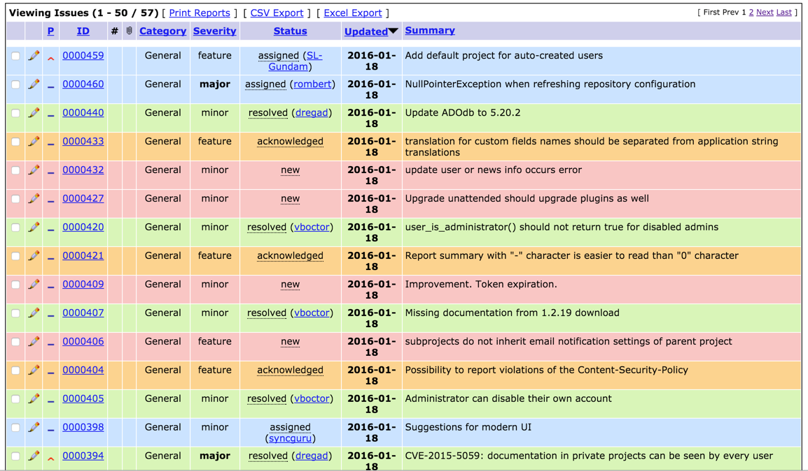

# MantisSeeder

Often as developers of MantisBT or plugins for it, we need test data to work
with.  Instead of always doing this manually or using production data, this
plugin provides a 'Seed' option under the Manage menu which provides
administrator with the ability to create 100 test issues under a couple of 
test project.  The data is based on real data from the Mantis Bug Tracker.

## Sample Seed Data

## Credits

- This plugin uses [Mantis PHP client library](https://github.com/mantishub/mantis-php-client)
  to pull data from [MantisBT's official bug tracker](https://www.mantisbt.org/bugs/).

## Supported Versions

- MantisBT 1.2.x - not tested
- MantisBT 1.3.x - supported
